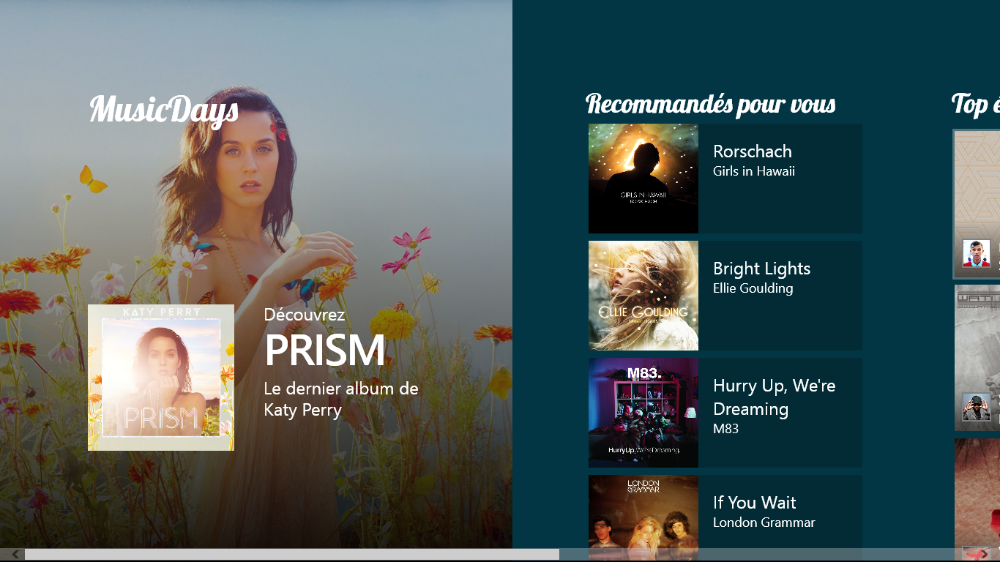
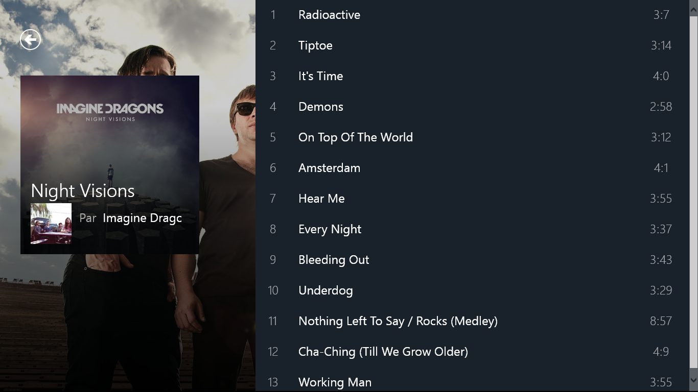

MusicDays
====================

Code utilisé lors de la session "Introduction au développement Windows 8.1" lors des Microsoft TechDays 2014 - Paris.

Retrouvez les slides et la vidéo de la session sur [http://maneu.net/techdays14-windows81](http://maneu.net/techdays14-windows81).

Cette application, utilisant l'api **[Deezer](http://developers.deezer.com)** permet de vous afficher un ensemble d'albums recommandés, ainsi que le Top écoutes du moment. Dans cet exemple, les recommendations sont "en dur" dans le code. Le reste des informations provient de l'API Deezer.

Si vous souhaitez utiliser l'API Deezer depuis une application .net, je vous encourage à regarder le projet [Deezer .net API](https://github.com/cmaneu/deezer-net-api), sur Github.

<iframe src="http://ghbtns.com/github-btn.html?user=cmaneu&repo=deezer-net-api&type=fork"
  allowtransparency="true" frameborder="0" scrolling="0" width="54" height="20"></iframe>

